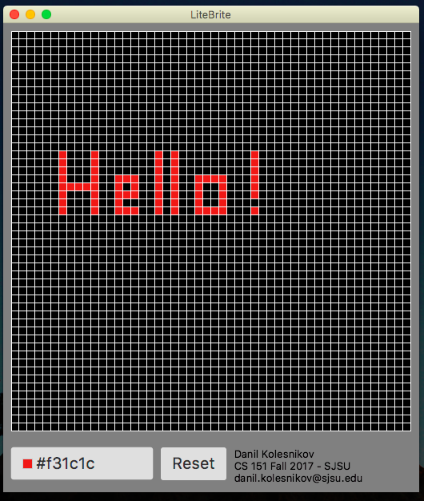

# LiteBrite
> Java program simulating litebrite game. 



## Installation

GUI:

Click on the executable litebrite.jar file found in out/artifacts/

Command line:

```sh
java -jar litebrite.jar
```
## Meta

Danil Kolesnikov – danil.kolesnikov@sjsu.edu

Distributed under the MIT license.
